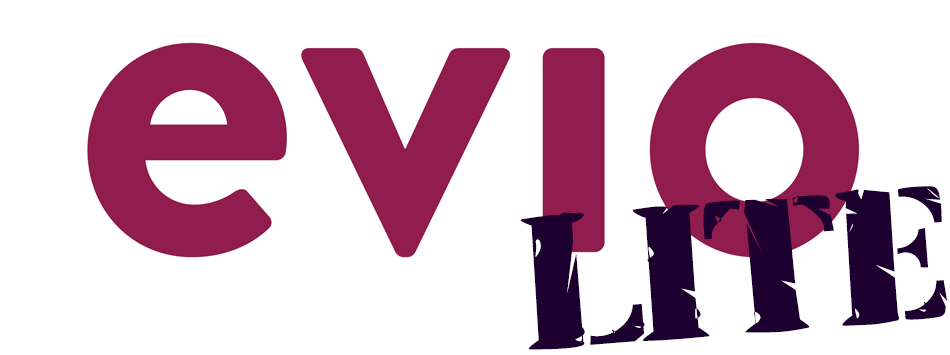

 

`evio-lite` is an event loop networking framework that is extra small and fast. It's the lite version of the [evio](https://github.com/tidwall/evio) package. 

So what's different about this version?

It's totally single-threaded. The big evio has support for spreading loops over threads. Not this one. Only one thread. Don't question my motives. I don't care about your feelings on the matter. Also it only runs on BSD and Linux machines. These are the only machines I deal with. Again, I don't care what you say.

There are a few subtle differences between the two APIs, but otherwise they work in the same. 

Enjoy! (or not, whatever)
